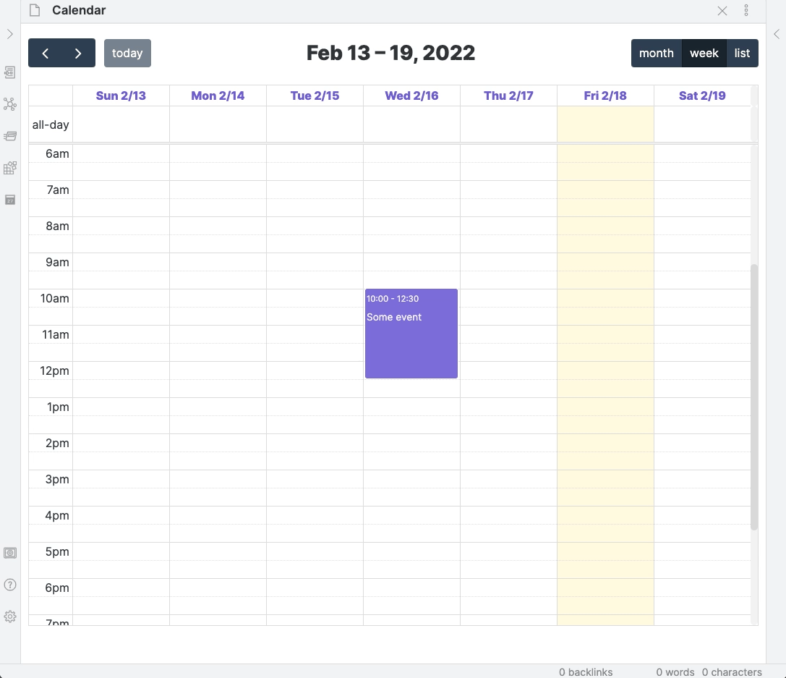

# Obsidian Full Calendar Plugin

Keep your calendar in your vault! This plugin integrates the [FullCalendar](https://github.com/fullcalendar/fullcalendar) library into your Obsidian Vault so that you can keep your ever-changing daily schedule and special events and plans alongside your tasks and notes, and link freely between all of them. Each event is stored as a separate note with special frontmatter so you can take notes, form connections and add context to any event on your calendar.

The FullCalendar library is released under the [MIT license](https://github.com/fullcalendar/fullcalendar/blob/master/LICENSE.txt) by [Adam Shaw](https://github.com/arshaw). It's an awesome piece of work, and it would not have been possible to make something like this plugin so easily without it.


- [Obsidian Full Calendar Plugin](#obsidian-full-calendar-plugin)
  - [Installation](#installation)
    - [BRAT](#brat)
    - [Manual Installation](#manual-installation)
  - [Features](#features)
    - [Getting Started](#getting-started)
      - [Add and modify local calendars](#add-and-modify-local-calendars)
    - [Opening the calendar](#opening-the-calendar)
    - [Creating Events](#creating-events)
      - [Via event modal](#via-event-modal)
      - [Via click-and-drag](#via-click-and-drag)
      - [Full day events](#full-day-events)
      - [Recurring events](#recurring-events)
    - [Editing Events](#editing-events)
      - [Change time of event by dragging its endpoint](#change-time-of-event-by-dragging-its-endpoint)
      - [Move an event around on a day or between days](#move-an-event-around-on-a-day-or-between-days)
    - [Dataview integration](#dataview-integration)
  - [Coming soon](#coming-soon)
    - [Import from Google Calendar](#import-from-google-calendar)
    - [Mobile UI Optimizations](#mobile-ui-optimizations)
    - [Create event notes with a template](#create-event-notes-with-a-template)
    - [Subscribe to public calendar feeds](#subscribe-to-public-calendar-feeds)
  - [Long term plans](#long-term-plans)
    - [Track tasks in the calendar](#track-tasks-in-the-calendar)

## Installation

Full Calendar is currently in beta. I'm planning on submitting it to the community plugin registry soon, but right now it's available in two other ways.

### BRAT

Full Calendar can currently be installed through the [Beta Reviewer's Auto-update Tool](https://github.com/TfTHacker/obsidian42-brat) using the GitHub path `davish/obsidian-full-calendar`.

### Manual Installation

If you don't want to use BRAT, head over to the [releases page](https://github.com/davish/obsidian-full-calendar/releases) and unzip the latest release inside of the `.obsidian/plugins` directory inside your vault.

## Features

### Getting Started

#### Add and modify local calendars

All events live in `/events` in your vault by default, but you can change this to any directory, add a new source and change colors by going to settings.

<details>
<summary>Click for GIF example</summary>

</details>

### Opening the calendar

Either click on the ribbon icon, or run the "Full Calendar: Open Calendar" command from the command palette.

<details>
<summary>Click for GIF example</summary>

</details>

### Creating Events

#### Via event modal

Use the "Create event" command to bring up the event modal to add a new event. Clicking on any existing event will also bring up the modal for editing.

<details>
<summary>Click for GIF example</summary>

</details>

#### Via click-and-drag

Just click-and-drag on the calendar to create an event. The modal will pop up where you can fill in the details and tweak the timing.

<details>
<summary>Click for GIF example</summary>

</details>

#### Full day events

Can create events that last all day instead of giving a start and end time.

<details>
<summary>Click for GIF example</summary>

</details>

#### Recurring events

Let a single event note show up on a set schedule by checking the "Recurring event" box in the event modal.

<details>
<summary>Click for GIF example</summary>

</details>

### Editing Events

In addition to editing events through the modal, you can also click-and-drag
to change the time range or the date of an event.

#### Change time of event by dragging its endpoint

<details>
<summary>Click for GIF example</summary>

</details>

#### Move an event around on a day or between days

<details>
<summary>Click for GIF example</summary>

</details>

### [Dataview](https://github.com/blacksmithgu/obsidian-dataview) integration

Create calendars inline with your notes from [dataviewjs](https://blacksmithgu.github.io/obsidian-dataview/api/intro/) queries. Here's a basic example with a hardcoded event:

````
```dataviewjs
const { renderCalendar } = app.plugins.plugins["obsidian-full-calendar"];
let calendar = renderCalendar(this.container, [{startDate: "2022-01-26", startTime: "17:00", endTime: "22:00", id: "id", title: "This is an event"}]);
calendar.render();
```
````

`renderCalendar()` exposes the FullCalendar API directly, so check out [the event parsing documentation](https://fullcalendar.io/docs/event-parsing) to see everything you can do here!

## Coming soon

This plugin is in its early days -- here are some features I plan to work on next, in rough order of priority. If you have any ideas or want to vouch for one of these, [submit an issue](https://github.com/davish/obsidian-full-calendar/issues)!

### Import from Google Calendar

Make the transition easier by loading in all your events from an existing Google Calendar and maintain a one-way sync.

### Mobile UI Optimizations

Full Calendar is usable on mobile at the moment, but there are some UX improvements to make it look better on small screens.

### Create event notes with a template

Support for the core Templates plugin and Templater.

### Subscribe to public calendar feeds

Add auto-updating read-only feeds for your friends' calendars.

## Long term plans

### Track tasks in the calendar

Surface tasks from throughout your vault on your calendar, and schedule them in blocks during your day to fill out your agenda. Inspired by (the as-yet-unreleased) [amie calendar](https://amie.so).
