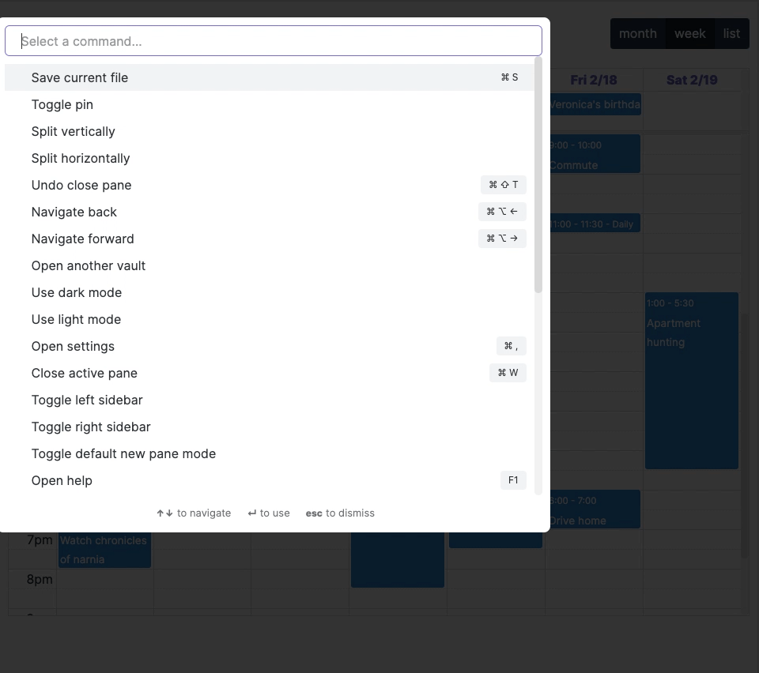
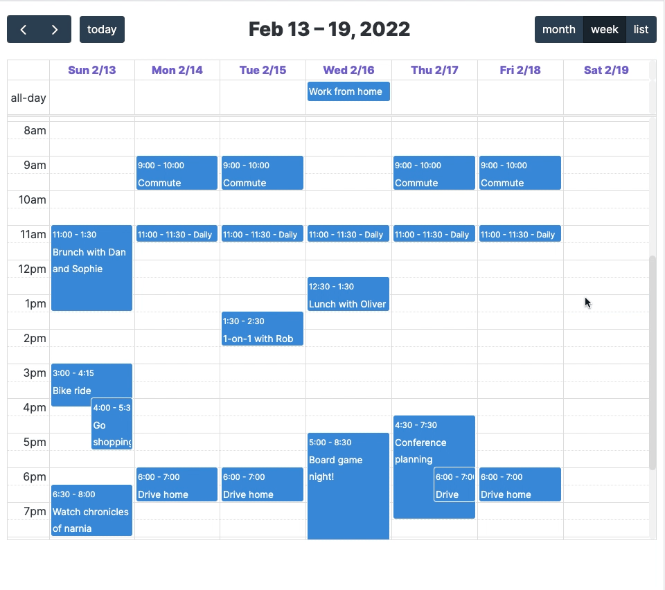
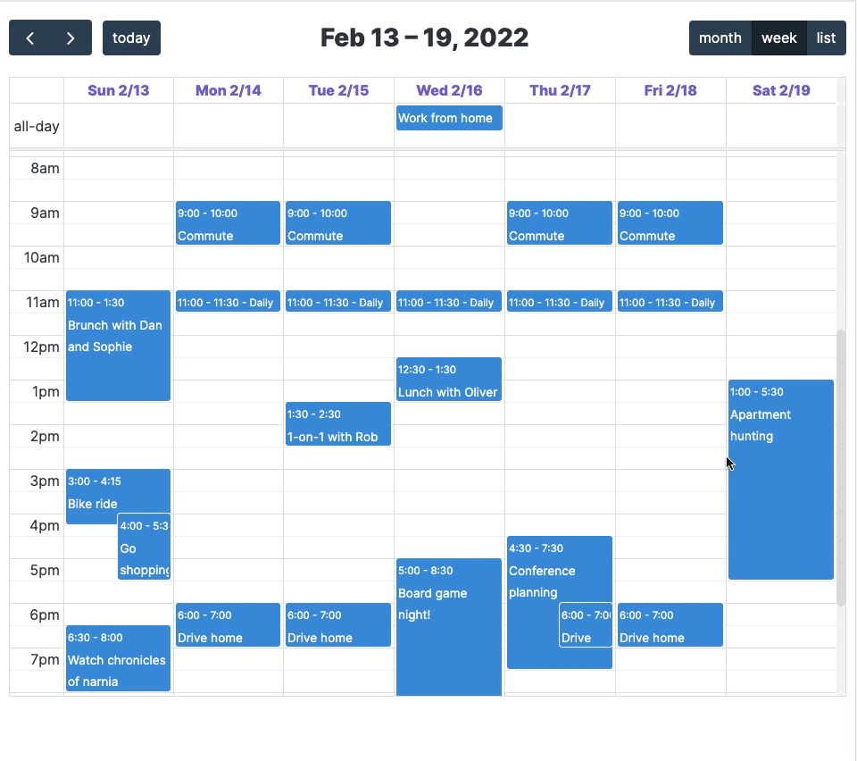
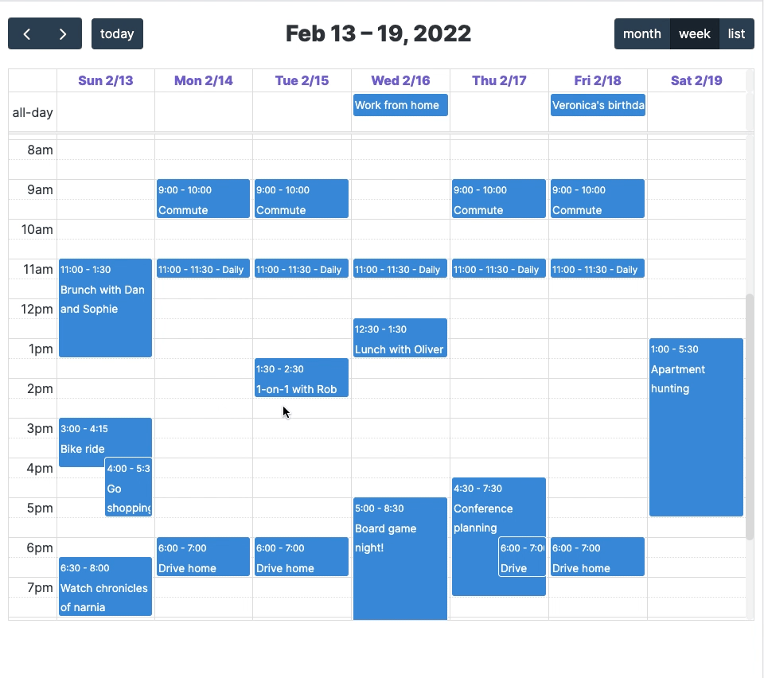
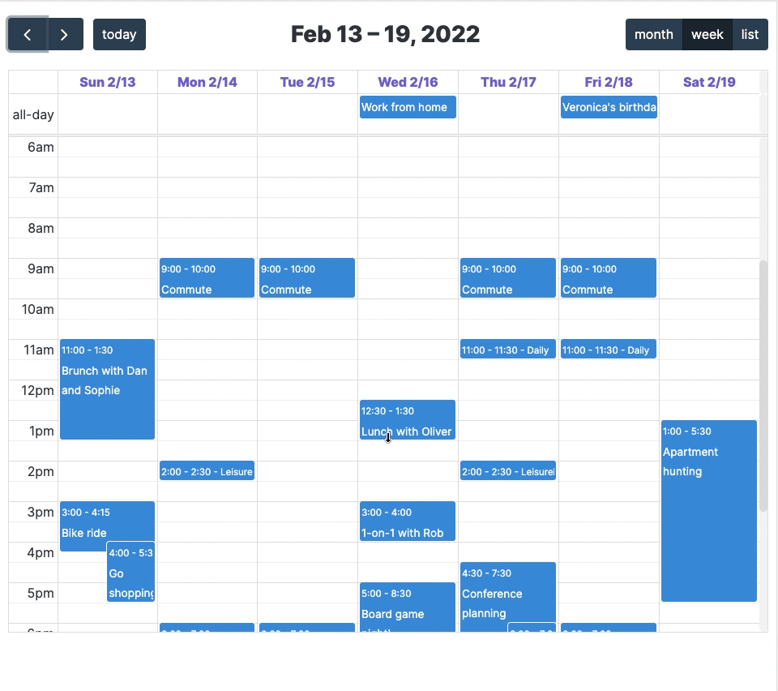
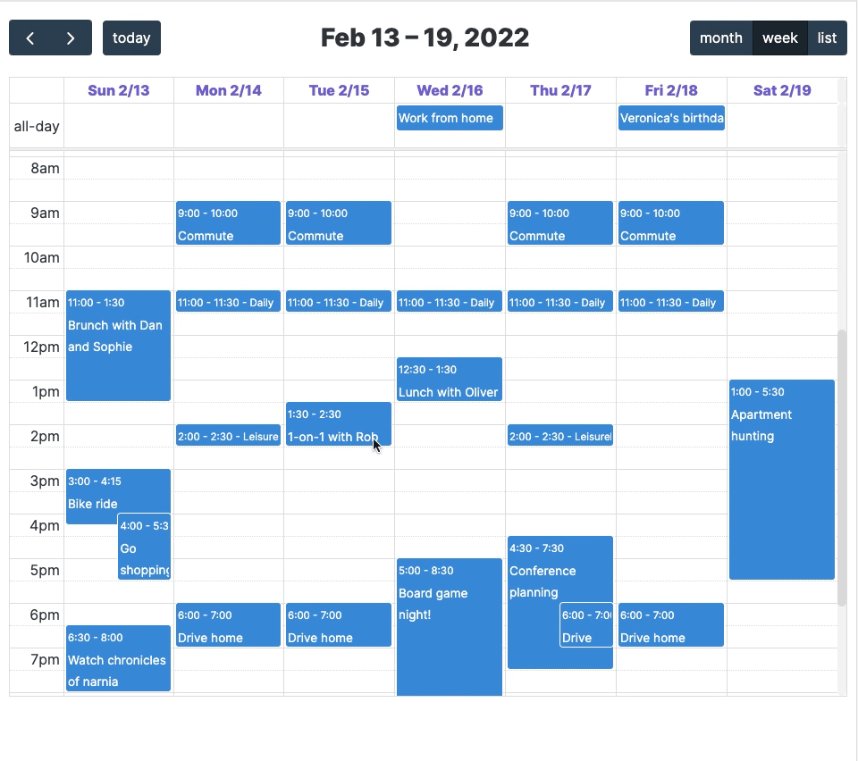

# Obsidian Full Calendar Plugin

Keep your calendar in your vault! This plugin integrates the [Full Calendar](https://github.com/fullcalendar/fullcalendar) library into your Obsidian Vault so that you can keep your events and plans alongside your tasks and notes, and link freely between all of them. Each event is stored as a separate note with special frontmatter so you can take notes and add context to any event on your calendar.

The Full Calendar library is released under the [MIT license](https://github.com/fullcalendar/fullcalendar/blob/master/LICENSE.txt) by [Adam Shaw](https://github.com/arshaw). It's an awesome piece of work, and it would not have been possible to make something akin to this plugin so easily without it.


- [Obsidian Full Calendar Plugin](#obsidian-full-calendar-plugin)
  - [Features](#features)
    - [Creating Events](#creating-events)
      - [Event modal](#event-modal)
      - [Click-and-drag to make an event](#click-and-drag-to-make-an-event)
      - [Full day events](#full-day-events)
      - [Recurring events](#recurring-events)
    - [Editing Events](#editing-events)
      - [Change time of event by dragging its endpoint](#change-time-of-event-by-dragging-its-endpoint)
      - [Move an event around on a day or between days](#move-an-event-around-on-a-day-or-between-days)
    - [Settings](#settings)
      - [Change the events directory](#change-the-events-directory)
    - [Dataview integration](#dataview-integration)
  - [Coming soon](#coming-soon)
    - [Import from Google Calendar](#import-from-google-calendar)
    - [Support for multiple calendars with different colors](#support-for-multiple-calendars-with-different-colors)
    - [Create event notes with a template](#create-event-notes-with-a-template)
    - [Subscribe to public calendar feeds](#subscribe-to-public-calendar-feeds)
  - [Long term plans](#long-term-plans)
    - [Track tasks in the calendar](#track-tasks-in-the-calendar)

## Features

### Creating Events

#### Event modal

Use the "Create event" command to bring up the event modal to add a new event. Clicking on any existing event will also bring up the modal for editing.


#### Click-and-drag to make an event

Just click-and-drag on the calendar to create an event. A modal will pop up where you can fill in the details and tweak the timing.


#### Full day events

Can create events that last all day instead of giving a start and end time.


#### Recurring events

Let a single event note show up on a set schedule by checking the "Recurring event" box in the event modal.



### Editing Events

In addition to editing events through the modal, you can also click-and-drag
to change the time range or the date of an event.

#### Change time of event by dragging its endpoint



#### Move an event around on a day or between days



### Settings

#### Change the events directory

All events live in `/events` in your vault by default, but you can change this to any directory by going to settings.

### Dataview integration

Create calendars inline with your notes from [dataviewjs](https://blacksmithgu.github.io/obsidian-dataview/api/intro/) queries. Here's a basic example with a hardcoded event:

````
```dataviewjs
const { renderCalendar } = app.plugins.plugins["obsidian-full-calendar"];
let calendar = renderCalendar(this.container, [{startDate: "2022-01-26", startTime: "17:00", endTime: "22:00", id: "id", title: "This is an event"}]);
calendar.render();
```
````

`renderCalendar()` exposes the Full Calendar API directly, so check out [the event parsing documentation](https://fullcalendar.io/docs/event-parsing) to see everything you can do here!

## Coming soon

This plugin is in its early days -- here are some features I plan to work on next, in rough order of priority. If you have any ideas or want to vouch for one of these, [submit an issue](https://github.com/davish/obsidian-full-calendar/issues)!

### Import from Google Calendar

Make the transition easier by loading in all your events from an existing Google Calendar and maintain a one-way sync.

### Support for multiple calendars with different colors

Easy enough. Add and remove calendars in your settings, each calendar has its own folder in your Vault.

### Create event notes with a template

Support for the core Templates plugin and Templater.

### Subscribe to public calendar feeds

Add auto-updating read-only feeds for your friends' calendars.

## Long term plans

### Track tasks in the calendar

Surface tasks from throughout your vault on your calendar, and schedule them in blocks during your day to fill out your agenda. Inspired by (the as-yet-unreleased) [amie calendar](https://amie.so).
