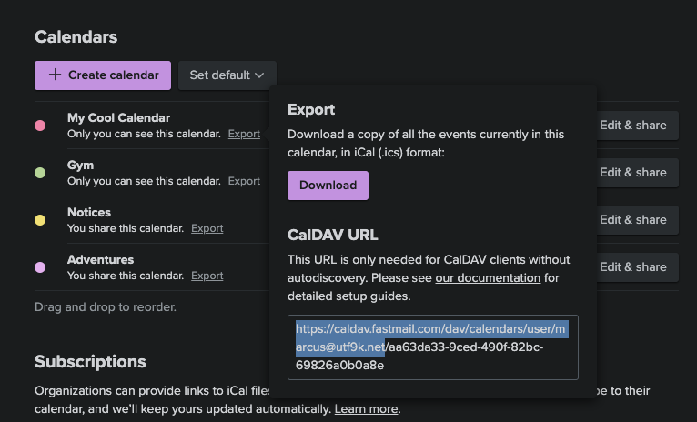

# Remote calendar from private iCloud or any CalDAV source

You can add any calendar that supports CalDAV over HTTPS basic authentication with a few providers already confirmed to work.

## Apple Calendar

In order to use your [iCloud Calendar](https://www.icloud.com/calendar), you'll first need to create an [app-specific password](https://support.apple.com/en-us/HT204397). Armed with that info, you can now add your private Apple Calendars.


## Fastmail

In order to set up Fastmail, you'll want to set the calendar dropdown to `CalDAV` and click the add button to open the setup dialog.

To continue, we'll need to fill out a few fields.

### Username

This is just your email address, whether it's an `@fastmail.com` address or a custom domain. If in doubt, such as if you have a sub account within a Fastmail organisation, you can confirm your address by logging into the web UI and checking the address listed in the top left corner.

### Password

As above, you'll want to make an [app password](https://www.fastmail.help/hc/en-us/articles/360058752854-App-passwords) to populate your calendar by navigating to `Settings` -> `Passwords & Security` -> `Third-party apps (Manage)` and creating a new password.

Under the `Access` dropdown, you can create a password restricted to the `Calendars (CalDAV)` scope.

### URL

We need to deviate a bit from the [official Fastmail documentation](https://www.fastmail.help/hc/en-us/articles/1500000278342-Server-names-and-ports) here and reference the specific calendar endpoint for your account.

If your email address used in the `Username` section is `user@example.com`, then your URL field will need to look like so:

```
https://caldav.fastmail.com/dav/principals/user/user@example.com/
```

If in doubt, you can find the specific URL by navigating to `Settings` -> `Calendars` and then click `Export` on any of the calendars you have.

Under `CalDAV URL`, you can copy the URL but make sure you **only** copy up to the trailing slash after your email address as shown in the codeblock just above.



### Flythrough


## Non-working providers

There are a few providers which are not yet supported by the CalDAV sync option.