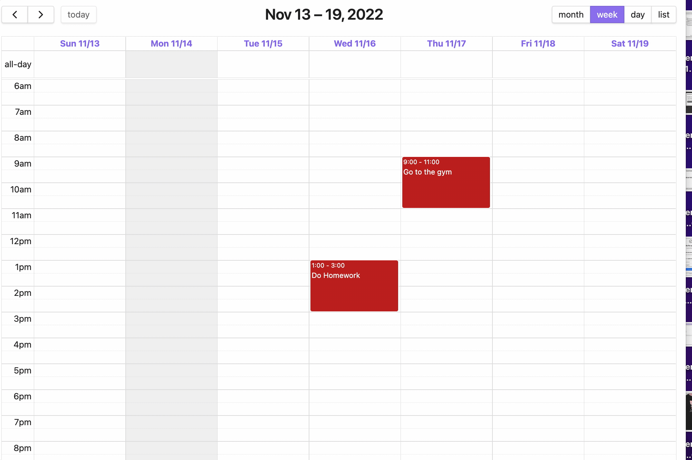

# Tasks in events

Turn your events into tasks in the edit modal or the right-click menu. You can then mark an event as "completed",and the completion time will be recorded in the event frontmatter.

