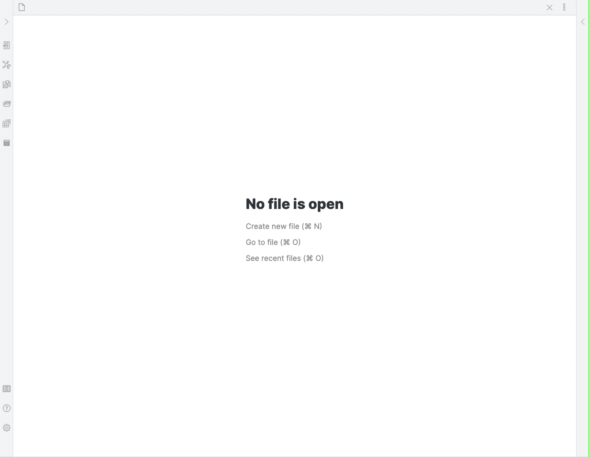
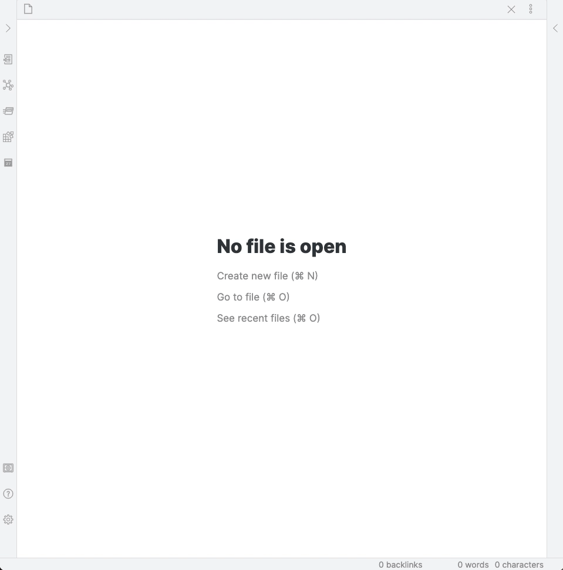

# Getting started

## Welcome page

Open Full Calendar from the command palette or the ribbon icon for the first time and you'll be prompted to add a calendar. It's recommended that you add either a [Daily Note calendar](calendars/dailynote) or a [full note calendar](calendars/local) based in a directory in your Vault so that you can create and modify events. Remote calendars are currently read-only.

## Opening the calendar

Either click on the ribbon icon, or run the "Full Calendar: Open Calendar" command from the command palette.

## Sidebar Calendar

You can also open the calendar in the sidebar with the "Open in sidebar" command.

