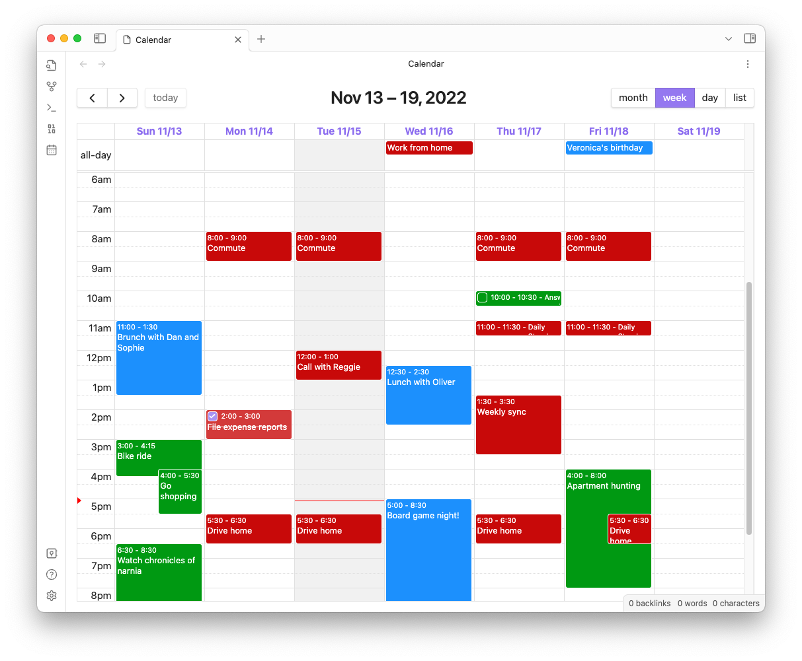

# Obsidian Full Calendar

Keep your calendar in your vault! This plugin integrates the [FullCalendar](https://github.com/fullcalendar/fullcalendar) library into your Obsidian Vault so that you can keep your ever-changing daily schedule and special events and plans alongside your tasks and notes, and link freely between all of them. Each event is stored as a separate note with special frontmatter so you can take notes, form connections and add context to any event on your calendar.

The FullCalendar library is released under the [MIT license](https://github.com/fullcalendar/fullcalendar/blob/master/LICENSE.txt) by [Adam Shaw](https://github.com/arshaw). It's an awesome piece of work, and it would not have been possible to make something like this plugin so easily without it.

Most of this documentation is presented as GIF walkthroughs. If something is unclear, don't hesitate to [submit an issue on GitHub](https://github.com/davish/obsidian-full-calendar/issues) or comment on an existing one.

<!-- comment -->

